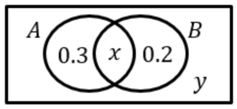

# WM160 Applied Maths I / Block 1 / Day 4 notes (2022-10-06)

## Independent events exercise

Given that $A$ and $B$ are independent, determine the values of $x$.

$$
\begin{align*}
P(A \cap B') &= 0.3 \\
P(B \cap A') &= 0.2 \\
P(A \cap B) &= P(A) \times P(B) \\
x &= P(A \cap B) \\
x &= (0.3 + x)(0.2 + x) \\
x &= x^2 + 0.5x + 0.06 \\
x^2 - 0.5x + 0.06 &= 0 \\
x &= \begin{cases} 0.3 \\ 0.2 \end{cases} \\
\therefore P(A \cap B) &= \begin{cases} 0.3 \\ 0.2 \end{cases} \\
\end{align*}
$$

## Binomial distribution

Binomial distribution is a discrete probability distribution, which is useful in many applications and situations.

### Conditions for use

- number of trials must be fixed
- each trial may only have two potential outcomes (a success and failure)
- the trials must be independent
- the probability of success is identical in each trial

### Syntax

For a variable, $X$, which follows a binomial distribution, we write:

$$
X \sim B(n, p)
$$

where $n$ is the number of trials, and $p$ is the probability of a successful outcome.

For example, if $Y$ denotes the number of heads in 3 unbiased coin tosses, it would be:

$$
Y \sim B(3, 0.5)
$$

### Mean, variance and standard deviation

Where...

$$
\begin{align*}
X &\sim B(n, p) \\
n &= \text{number of trials} \\
p &= \text{P(success)} \\
q &= \text{P(failure)} \\
\end{align*}
$$

mean, variation and standard deviation can be calculated as followed:

$$
\begin{align*}
\text{mean} &\rightarrow E(X) = np \\
\text{variance} &\rightarrow \sigma^2 = npq \\
\text{standard deviation} &\rightarrow \sigma = \sqrt{npq} \\
\end{align*}
$$

### Probability of $r$ successful outcomes

**Individual binomial probabilities**

$$
P(X = r) = {n \choose r} p^r(1-p)^{n-r}
$$

**Cumulative binomial probabilities**

$$
P(X \leq x) = \sum^{x}_{r=0} \left[ {n \choose r} p^r(1-p)^{n-r} \right]
$$

### Exercises

#### Exercise 1

> $X \sim B(8, 0.6)$
>
> Find the following probabilities:
>
> 1. $P(X = 0)$
> 2. $P(X = 3)$
> 3. $P(X = 6)$

$$
\begin{align*}
P(X = 0) &= {8 \choose 0}0.6^0(1-0.6)^{8-0} \\
&= {8 \choose 0}0.4^{8} \\
&= 0.4^{8} \\
P(X = 0) &\approx 0.000655 \text{ (3 s.f.)} \\
\end{align*}
$$

 

$$
\begin{align*}
P(X = 3) &= {8 \choose 3}0.6^3(1-0.6)^{8-3} \\
&= 56 \times 0.6^3 \times 0.4^5 \\
P(X = 3) &\approx 0.124 \text{ (3 s.f.)} \\
\end{align*}
$$

 

$$
\begin{align*}
P(X = 6) &= {8 \choose 6}0.6^6(1-0.6)^{8-6} \\
&= 28 \times 0.6^6 \times 0.4^2 \\
P(X = 6) &\approx 0.209 \text{ (3 s.f.)} \\
\end{align*}
$$

#### Exercise 2

> $X \sim B(10, 0.7)$
>
> Find the following probabilities:
>
> 1. $P(X = 0)$
> 2. $P(X = 1)$
> 3. $P(X > 1)$
> 4. $P(X < 3)$

$$
\begin{align*}
P(X = 0) &= {10 \choose 0} 0.7^0 (1 - 0.7)^{10 - 0} \\
&= (0.3)^{10} \\
&= (0.3)^{10} \\
P(X = 0) &\approx 0.00000591 \text{ (3 s.f.)} \\
\end{align*}
$$

 

$$
\begin{align*}
P(X = 1) &= {10 \choose 1} 0.7^1 (1 - 0.7)^{10 - 1} \\
&= 10 \times 0.7 \times 0.3^9 \\
P(X = 0) &\approx 0.000138 \text{ (3 s.f.)} \\
\end{align*}
$$

 

$$
\begin{align*}
P(X \leq x) &= \sum^{x}_{r=0} \left[ {n \choose r} p^r(1-p)^{n-r} \right] \\
P(X > 1) &= 1 - P(X \leq 1) \\
&= 1 - \sum^{1}_{r=0}({10 \choose r} 0.7^r (1 - 0.7)^{10 - r}) \\
&= 1 - \left[\left({10 \choose 0} 0.7^0 (1-0.7)^{10 - 0}\right) + \left({10 \choose 1} 0.7^1 (1-0.7)^{10 - 1}\right)\right] \\
&= 1 - \left[\left(0.3^{10}\right) + \left(10 \times 0.7 \times (0.3)^{9}\right)\right] \\
&= 1 - \left[\left(0.3^{10}\right) + \left(7 \times (0.3)^{9}\right)\right] \\
&= 1 - \left[\left(0.3^{10}\right) + \left(7 \times (0.3)^{9}\right)\right] \\
&= 0.999856314\dots \\
P(X > 1) &\approx 0.999 \text{ (3 s.f.)} \\
\end{align*}
$$

 

$$
\begin{align*}
P(X \leq x) &= \sum^{x}_{r=0} \left[ {n \choose r} p^r(1-p)^{n-r} \right] \\
P(X < 3) &= P(X \leq 2) \\
&= \sum^2_{r=0} \left[ {10 \choose r} 0.7^r (1-0.7)^{10-r} \right] \\
&= \left[ \left( {10 \choose 0} 0.7^0 (1-0.7)^{10-0} \right) + \left({10 \choose 1} 0.7^1 (1-0.7)^{10-1}\right) + \left({10 \choose 2} 0.7^2 (1-0.7)^{10-2}\right) \right] \\
&= \left[ \left(0.3^{10}\right) + \left( 10 \times 0.7 \times 0.3^9 \right) + \left(45 \times 0.49 \times 0.3^8 \right) \right] \\
&= \left[ \left(0.3^{10}\right) + \left( 7 \times 0.3^9 \right) + \left(22.05 \times 0.3^8 \right) \right] \\
&= \left[ \left(0.3^{10}\right) + \left( 7 \times 0.3^9 \right) + \left(22.05 \times 0.3^8 \right) \right] \\
&= 0.001590386\dots \\
P(X > 1) &\approx 0.00159 \text{ (3 s.f.)} \\
\end{align*}
$$

#### Exercise 3

> $X \sim B(12, 0.4)$
>
> 1. Find the expectation
> 2. What is the most likely outcome for $X$

$$
\begin{align*}
E(X) &= np \\
&= 12 \times 0.4 \\
&= 4.8 \\
\end{align*}
$$

 

$$
\text{The most likely outcome is } x = 5
$$

#### Exercise 3

> $X \sim B(8, 0.4)$
>
> 1. Find the expectation
> 2. What is the most likely outcome for $X$

$$
\begin{align*}
E(X) &= np \\
&= 8 \times 0.4 \\
&= 3.2 \\
\end{align*}
$$

 

$$
\text{The most likely outcome is } x = 3
$$

#### Exercise 4

> An online store claims that 75% of orders are dispatched on the next working day.
>
> I use this store online regularly, and only 4 out of my last 10 orders were dispatched on the next working day.
>
> 1. What is the probability using the store's figures that exactly 4 out of 10 orders are dispatched the next working day?
> 2. What is the probability using the store's figures that fewer than 4 out of 10 orders are dispatched the next working day?

$$
\begin{align*}
X \sim B(10, 0.75) \\
P(X = 4) &= {10 \choose 4} 0.75^4 \times 0.25^{6} \\
&= 210 \times 0.75^4 \times 0.25^6 \\
&= 0.016222000\dots \\
\therefore P(X = 4) &\approx 0.0162 \text{ (3 s.f.)}
\end{align*}
$$

1.62% chance that 4 of 10 orders would be dispatched the next working day.

 

$$
\begin{align*}
X \sim B(10, 0.75) \\
P(X < 4) &= P(X \leq 3) \\
&= \sum^3_{r=0} \left[ {10 \choose r} 0.75^r (1-0.75)^{10-r} \right] \\
\therefore P(X <= 3) &\approx 0.00351  \text{ (3 s.f.)}
\end{align*}
$$
