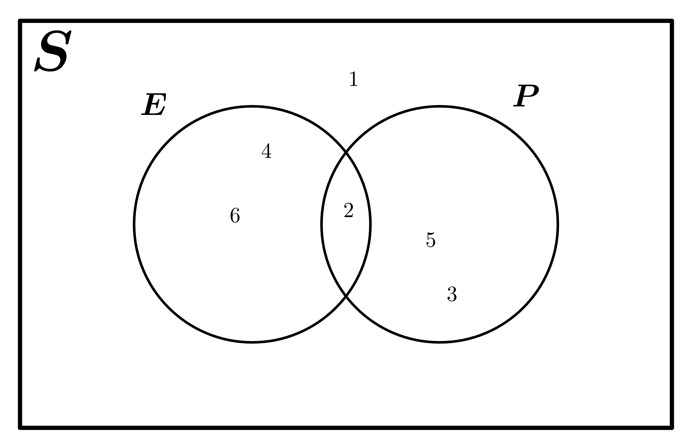

# WM160 Applied Maths I / Block 1 / Day 3 notes (2022-10-05)

## Measures of spread (continued)

### Interquartile range

The interquartile range is the difference between the first quartile ( $Q_{1}$ ) and the third quartile ( $Q_{3}$ ).

$Q_1$ can be calculated by finding the median of the lower half of the sorted dataset (excluding the overall median).

$$
\begin{align*}
\{ 1, 2, 3, 4, 5, 6, 7 \} \\
Q_1 &= 2 \\
Q_2 &= 4 \\
Q_3 &= 6 \\
\text{IQR} = 6 - 2 &= 4 \\
\end{align*}
$$

We can use the IQR to find outliers in dataset. Typically, outliers can be defined as any value more than $1.5 \times \text{IQR}$ from the lower and upper quartiles. This can be shown as:

$$
x_{min} < Q_1 - 1.5 \times (Q_3 - Q-1) \\
x_{max} > Q_3 + 1.5 \times (Q_3 - Q-1) \\
$$

#### Box plots

Box plots are a way of representing a dataset and its spread.

A box plot of a dataset shows:

- the median
- the lower and upper quartiles
- the interquartile range
- the range (excluding outliers)
- outliers

An example labelled box plot is shown below:

> This is a derivative work of RobSeb's `Elements of a boxplot.svg` [available on Wikimedia Commons](https://commons.wikimedia.org/wiki/File:Elements_of_a_boxplot.svg), licensed under CC-BY-SA 3.0. This derivative is also licensed under CC-BY-SA 3.0.

## Probability

### Quiz notes

A repeatable process that gives rise to a number of outcomes is an **experiment**.

A particular result of an experiment is an **outcome**.

An outcome or set of outcomes to an experiement is an **event**.

The range of all possible outcomes of an experiment is called **sample space**.

When the occurrence of one event has no effect on the probability of the occurrence of another event, the two events are **independent**.

A complement of an event is equal to $1 - P_1$ where $P_1$ is the probability of the event. For example, if $P(event) = \frac{2}{7}$, the complement ( $P(event')$ ) will be $\frac{5}{7}$.

A collection of one or more outcomes is called an **event**. For example, if we roll a die three times, we could get $\{1, 6, 3\}$. Each individual roll is an outcome, but the collection of all three rolls is an **event**.

$$
\begin{align*}
P(A) = P(B) &= 0.2 \\
P(A') = P(B') &= 0.8 \\
P(A' \cap B') = P(A') \times P(B') = 0.8 \times 0.8 &= 0.64
\\
\end{align*}
$$

When you generate $n$ outcomes, where there are $x$ potential outcomes each time, the number of potential outcomes is $x^n$.

For example, if you roll an unbiased die (6 potential outcomes) 5 times, the overall number of potential outcomes if $6^5 = 7776$.

### Probability rules

$$
\begin{align*}
  0 \leq P(A)\leq 1 \\
  P(A) + P(A') &= 1 \\\\
  \text{Mutually exclusive events}&\text{:} \\
  P(A \cup B) &= P(A) + P(B) \\\\
  \text{Non-mutually exclusive events}&\text{:} \\
  P(A \cup B) &= P(A) + P(B) - P(A \cap B) \\
\end{align*}
$$

### Examples

#### Rolling a die

$$
P(E) = \text{chance of rolling an even number} = 0.5 \\
P(P) = \text{chance of rolling a prime number} = 0.5 \\
$$

$$
\begin{align*}
  P(E \cap P) &= 0.5 \\
              &= \frac{1}{6} \\
\end{align*}
$$

$$
\begin{align*}
  P(E \cup P) &= P(E) + P(P) - P(E \cup P) \\
              &= 0.5 + 0.5 - \frac{1}{6} \\
              &= \frac{5}{6} \\
\end{align*}
$$

#### Independent events

> Imagine a set of four numbers, $S$.

$$
S = \{ 1, 2, 3, 4 \}
$$

> What is the probability someone picks, at random, an even number?

$$
\begin{align*}
  E &= \{ 2, 4 \} \\
  P(E) = \frac{2}{4} &= 0.5 \\
\end{align*}
$$

> What is the probability someone picks, at random, a multiple of four?

$$
\begin{align*}
  F &= \{ 4 \} \\
  P(F) = \frac{1}{4} &= 0.25 \\
\end{align*}
$$

> State and prove whether these events are independent or not.

$$
\begin{align*}
  E \cap F &= \{ 2 \} \\
\end{align*}
$$

From Venn diagram:

$$
\begin{align*}
  P(E \cap F) &= \frac{1}{4} \\
\end{align*}
$$

If E and F are independent, then:

$$
\begin{align*}
  P(E \cap F) &= P(E) \times P(F) \\
\end{align*}
$$

Proof:

$$
\begin{align*}
  \frac{1}{4} &= 0.5 \times 0.25 \\
  0.25 &\neq 0.125 \\
\end{align*} \\
\therefore\text{ E and F are not independent}
$$
